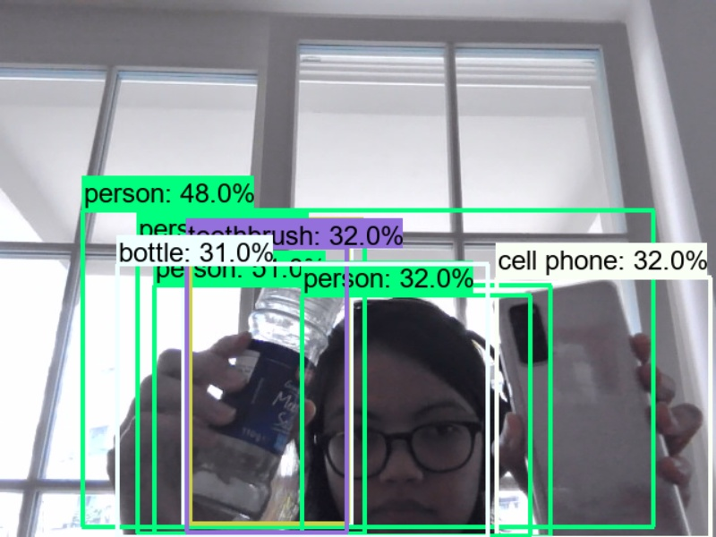

# Work-through of Tensorflow2.x Object Detection API

## Tech stack
* Anaconda Python38
* Tensorflow 2.2
* CUDA v10.1
* CuDNN 7.6.5
* PIP

## Getting started

Follow this tutorial to install all necessary software to start using the Tensorflow2 Object Detecting API
[Tensorflow2 Object Detecting API Tutorial](https://tensorflow-object-detection-api-tutorial.readthedocs.io/en/latest/install.html)

Install additional necessary packages with:

```shell
pip install -r requirements.txt
```

## 1. Webcam Object Detection

* related directory: `webcam-object-detection/`

This example will connect to the available webcam. Detect objects and save the detected objects in each frame plus the label to file.




### Usage

Each subproject needs to be run from its respected directory as its root. I.e. in your terminal from `object_detection/webcam-object-detection/` run

```shell
python main.py
```
